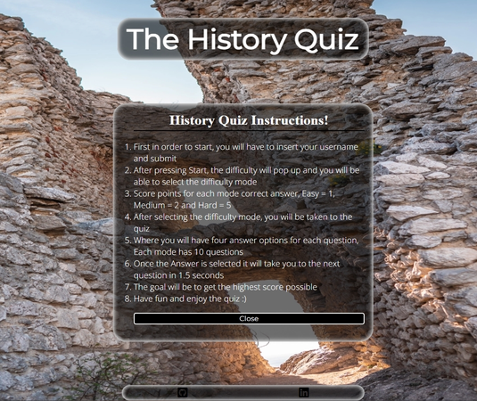
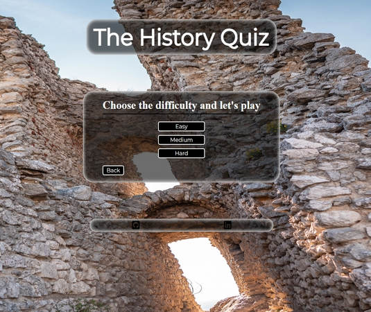

# **History Quiz**

## This website is a [The History Quiz](https://b1ndark.github.io/project2/),

The website is targeted for everyone, from young to elderly, there’s difficulty modes for everybody to enjoy :).

You can enjoy the different modes provided so you can test your knowledge regarding the history.

Users of this website will test and acquire knowledge.

Will also be able to see how you have score at the end.
 

[My Quiz website on Am I Responsive](https://ui.dev/amiresponsive?url=https://b1ndark.github.io/project2/)

---

## **Content**

- [**History Quiz**](#history-quiz)
  - [This website is a History Quiz,](#this-website-is-a-history-quiz)
  - [**Content**](#content)
  - [**User Experience**](#user-experience)
  - [**Design**](#design)
    - [Typography](#typography)
    - [Wireframes](#wireframes)
    - [Features](#features)
  - [Programs and tools used](#programs-and-tools-used)
  - [Languages used and its tests](#languages-used-and-its-tests)
  - [Accessibility](#accessibility)
  - [Testing](#testing)
  - [Bugs](#bugs) 
  - [Deployment](#deployment)
  - [Credits](#credits)
  - [Acknowledgments](#acknowledgments)

---

## **User Experience**

Visitors:

- Users will be presented with a Quiz website that will test their knowledge.
- The users will acquire knowledge of what they might not know.
- They will be able to test the three difficulty modes presented.

Goals:

- First of all the main goal is for the user to have fun
- Play solo or in a group to test your History knowledge
- Go through every difficulty mode :).

The website:

- Starting at the begining the user will be presented with the ruins of a Castle in the Background
- Within the same page the user will have a box in the middle of the screen with options that when pressed:
    - START option will take you to the difficulty mode
    - INSTRUCTIONS option will pop up a box with all instructions needed to play the quiz
- Once in the difficulty menu the user will be able to select three option modes:
    - EASY - The easiest mode for starters
    - MEDIUM - The medium mode for users with some knowledge
    - HARD - The hard mode for users that love the challenge.
- Once the mode selected you will be presented with Questions that will have 4 answer options
    - At the top you will be able to keep track of what question you are on and also your score.
    - Once an answer is selected it will lock all other answers and show you whether you got it correct or not.
    - Then will automatically move to the next question.
- At the end of the quiz you will have a box that will congratulate you and present you will the score obtained.
- After all that you can press Main Menu button which will take you back to the begining.

[Back to the top](#history-quiz)

---

## **Design**

### Typography

Fonts used came from [Google Fonts](https://fonts.google.com/):

- ['Open sans', sans-serif](https://fonts.google.com/specimen/Open+Sans)
- ['Montserrat', sans-serif](https://fonts.google.com/specimen/Montserrat)

Font colors used:

- Black: #000000
- White: #fff / rgb(255, 255, 255)
- Green: rgb(21, 219, 4)
- Red: rgb(236, 32, 32)
 

[Back to the top](#history-quiz)

---

### Wireframes

- Created for mobile devices and desktops

  - Home Page  
      
     

  - Page  
      
     

  - Page  
      
     

  - Page  
      
     

  - Page  
      
     

[Back to the top](#history-quiz)

---

### Features

   

- #### Main Page

    - The main page presents a photo of ruins of a castle in the background.
    - You have a container in the midle of the screen with some options.

    

   

- #### Instructions Container

    - This page shows you the procedures to take 
    -

    

   

- #### Difficulty Page

    - Here You will have a container with options and the ruins of a Castle in the background.
    - Options are Easy, Medium and Hard.

    

   

- #### Questions Container Page

    - Once selected the mode  you will have this container with the questions.
    - As you select the answer, it will show you whether you have got it right or not.
    - Question number and score presented above the question.

    

   

- #### End Page

    - You will get a message with your score to congratulate you.

    

   

- #### 404 Error page

    - This is a 404 Error page, just stating that the page wasn't found and gives the user a choice of going back to the Home page.

    

[Back to the top](#history-quiz)

---

## Programs and tools used

- [Codeanywhere](https://app.codeanywhere.com/) - To create the website.
- [Github](https://github.com/) - Where the website is stored.
- [Google Fonts](https://fonts.google.com/) - For the fonts used in the website.
- [Uiward](https://uizard.io/) - To create wireframes.
- [Favicon](https://favicon.io/) - To create favicon.
- [Am I Responsive?](https://ui.dev/amiresponsive) - To display the website on different websites.
- [Spell Check](https://chrome.google.com/webstore/detail/webpage-spell-check/mgdhaoimpabdhmacaclbbjddhngchjik/related) - To check spelling.
- [Google Tools](https://developer.chrome.com/docs/devtools/) - to check website styling and responsiveness.
- [Cloud Convert](https://cloudconvert.com/) - To convert the images to different files.
- [Gyazo](https://gyazo.com/) - To take Screenshots.
- [Google maps](https://www.google.com/maps/) - To provide locations.
- [Font Awesome](https://fontawesome.com/) - To display icons.
- [W3C HTML](https://validator.w3.org/#validate_by_input) - To verify HTML.
- [W3C CSS](https://jigsaw.w3.org/css-validator/#validate_by_input) - To verify CSS.
- [Microsoft Word](https://www.microsoft.com/en-gb/microsoft-365/word?activetab=tabs%3afaqheaderregion3) - Used to write most of my documents.

[Back to the top](#history-quiz)

---

## Languages used and its tests

- ### HTML

  - No errors were found when tested with W3C vallidator.

    - Page  
        
       

    - Page  
        
       

    - Page  
        
       

    - Page  
        
       

    - Page  
        
       

    - 404 Error Page  
        
       

- ### CSS
  - No errors were found when tested with W3C (Jigsaw) validator.
    - CSS  
      

[Back to the top](#history-quiz)

---

## Accessibility

I did focus on making sure that the website is accessible:

-
-
-
-
-
-

[Back to the top](#history-quiz)

---

- ### Lighthouse

  - I can confirm that the fonts and colors chosen are easy to read and also Lighthouse performed really good.

    - #### Page

        
       

    - #### Page

        
       

    - #### Page

        
       

    - #### Page

        
       

    - #### Page
        
       

[Back to the top](#history-quiz)

---

## Testing

-
-
-
-
-
-  

[Back to the top](#history-quiz)

---

## Bugs

- -
- -
- -
-     -
   

[Back to the top](#history-quiz)

---
 
## Deployment

- The website was deployed to Github pages. Steps to deploy: 1. Log in into your github account. 2. In the Github repository select the project. 3. Navigate to the settings tab. 4. Then scroll down and on your left select Pages. 5. Go to branch, and select master branch. 6. Once master branch is selected, wait a moment and it will provide a page link to the website.
  The live link can be found here - [My Website](https://b1ndark.github.io/project2/)
   

[Back to the top](#history-quiz)

---

## Credits

- ### Content

      - 
      - 
      - 
      - [kwizzbit](https://kwizzbit.com/history-quiz-questions-and-answers/)
      - [Thought Catalog](https://thoughtcatalog.com/katee-fletcher/2020/04/history-trivia-questions/)
      - [Google Search](https://www.google.com/)

   

- ### Media

  -

  - Websites used-

    - [PicJumbo](https://picjumbo.com)
    - [Pixabay](https://pixabay.com)

  - Photos Authors and where to find them:

    - Background photo - photo of Orphan's Castle Ruins in Klentnice by Viktor Hanacek[Orphan's Castle Ruins](https://picjumbo.com/detail-of-the-orphans-castle-ruins-in-klentnice/)
    - 404error - photo of a Sad Emoti- by Silvia [sad emoti](https://pixabay.com/illustrations/emotiguy-sad-thoughtful-face-1654859/)

  - The Favicon generator used to create - [Favicon](https://favicon.io/favicon-generator/)
  - Footer social network links from:
    - [My Github page](https://github.com/b1ndark)
    - [My Linkedin page](https://www.linkedin.com/in/vitor-de-oliveira-50076b268/)

[Back to the top](#history-quiz)

---

## Acknowledgments

-
-

[Back to the top](#history-quiz)
