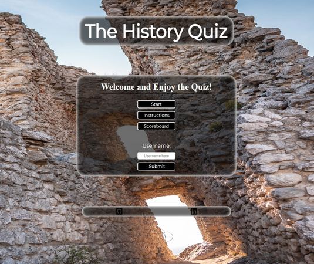
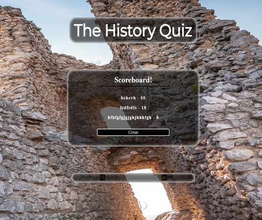
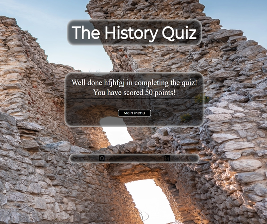
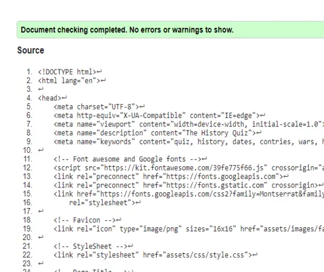
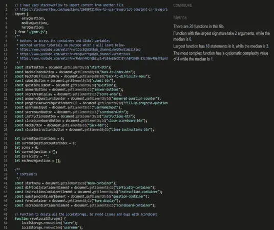
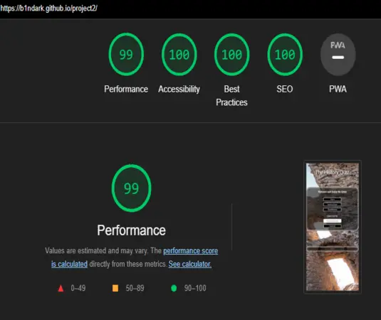

# **History Quiz**

## This website is a [The History Quiz](https://b1ndark.github.io/project2/),

<p>The website is targeted for everyone, from young to elderly, there’s difficulty modes for everybody to enjoy :).
<p>You can enjoy the different modes provided so you can test your knowledge regarding the history.
<p>Users of this website will test and acquire knowledge.
<p>Will also be able to see how much have you scored at the end.
<br>


[My Quiz website on Am I Responsive](https://ui.dev/amiresponsive?url=https://b1ndark.github.io/project2/)

---

## **Content**

- [**History Quiz**](#history-quiz)
  - [User Experience](#user-experience)
  - [Design](#design)
    - [Typography](#typography)
    - [Wireframes](#wireframes)
    - [Features](#features)
      - [Main Menu Container](#main-menu-container)
      - [Instructions Container](#instructions-container)
      - [Scoreboard Container](#scoreboard-container)
      - [Difficulty Container](#difficulty-container)
      - [Questions Container](#questions-container)
      - [End Page](#end-page)
      - [404 Error page](#404-error-page)  
  - [Programs and tools used](#programs-and-tools-used)
  - [Languages](#languages)
    - [HTML](#html)
    - [CSS](#css)
    - [JavaScript](#javascript)  
  - [Accessibility](#accessibility)
    - [Lighthouse](#lighthouse)
      - [Desktop Page](#desktop-page)
      - [Mobile Page](#mobile-page)  
  - [Testing](#testing)
  - [Bugs](#bugs) 
  - [Deployment](#deployment)
  - [Credits](#credits)
    - [Content](#content-1)
    - [Media](#media)  

  - [Acknowledgments](#acknowledgments)

---

## **User Experience**

Visitors:

- Users will be presented with a Quiz website that will test their knowledge.
- The users will acquire knowledge of what they might not know.
- They will be able to test the three difficulty modes presented.

Goals:

- First of all, the main goal is for the user to have fun
- Play solo or in a group to test your history knowledge
- Go through every difficulty mode :).
- To try achieve the top 5 in the scoreboard.

The website:

- Starting at the beginning the user will be presented with the ruins of a Castle in the Background.
- Within the same page the user will have a box in the middle of the screen with options that when pressed:
    - START - option will take you to the difficulty mode.
    - INSTRUCTIONS - option will pop up a box with all instructions needed to play the quiz.
    - SCOREBOARD - option will display the scoreboard of the quiz.
    - Input box - for the username to type the name in order to play the quiz.
    - SUBMIT - button to submit the username.
    - If user tries to start without entering username, an alert box will pop up to ask the user to enter username.
- Once in the difficulty menu the user will be able to select three option modes:
    - EASY - The easiest mode for starters.
    - MEDIUM - The medium mode for users with some knowledge.
    - HARD - The hard mode for users that love the challenge.
    - BACK - button to go back to main menu.
- Once the mode selected you will be presented with Questions that will have 4 answer options:
    - At the top you will be able to keep track of what question you are on and also your score.
    - Once an answer is selected it will lock all other answers and show you whether you got it correct or not.
    - Then will automatically move to the next question.
    - BACK - button to go back to difficulty menu.
- At the end of the quiz you will have a box that will congratulate you and present you will the score obtained.
- After all that you can press Main Menu button which will take you back to the beginning.

[Back to the top](#history-quiz)

---

## **Design**

### Typography

Fonts used came from [Google Fonts](https://fonts.google.com/):

- ['Open sans', sans-serif](https://fonts.google.com/specimen/Open+Sans)
- ['Montserrat', sans-serif](https://fonts.google.com/specimen/Montserrat)

Colours used:

- Black: #000000
- White: #fff / rgb(255, 255, 255)
- Green: rgb(21, 219, 4)
- Red: rgb(236, 32, 32)

  
<br>

[Back to the top](#history-quiz)

---

### Wireframes

- Created for mobile devices and desktops

  - Home Page  

      
    <br>  

  - Instructions Page  

      
    <br>  

  - Scoreboard Page  

      
    <br>  

  - Difficulty Page  

      
    <br>  

  - Questions Page  

      
    <br>  

  - End Page  

      
    <br>  

[Back to the top](#history-quiz)

---

### Features


  <br>

- #### Main Menu Container

    - Title of the website displayed at the top
    - The main page presents a photo of ruins of a castle in the background.
    - You have a container in the middle of the screen with some options:
      - Start Button
      - Instructions Button
      - Scoreboard Button
      - Input box
      - Submit Button  
      <br>

      

  <br>

- #### Instructions Container

    - This container shows you the procedures to take 
    - Back button to take you to Main Menu

      

  <br>

- #### Scoreboard Container

    - This container shows you the Scoreboard 
    - You will be able to check your score
    - Top 5 scores will be picked
    - Back button to take you to Main Menu

      

  <br>

- #### Difficulty Container

    - Here You will have a container with options and the ruins of a Castle in the background.
    - Options are Easy, Medium and Hard.
    - Back button to take you to Main Menu

      

  <br>

- #### Questions Container

    - Once selected the mode you will have this container with the questions.
    - As you select the answer, it will show you whether you have got it right or not:
      - Correct Answers - Shown in green
      - Wrong Answers - Shown in red  
      <br>
    - Question Progress Shown on top left
    - Correct Answers shown on top right
    - Back button to take you to Main Menu, when pressed you will be asked whether you want to carry on with the quiz or not

      

  <br>

- #### End Page

    - You will get a message with your score to congratulate you.

      

  <br>

- #### 404 Error page

    - This is a 404 Error page, just stating that the page wasn't found and gives the user a choice of going back to the Home page.

      

[Back to the top](#history-quiz)

---

## Programs and tools used

- [Codeanywhere](https://app.codeanywhere.com/) - To create the website.
- [Github](https://github.com/) - Where the website is stored.
- [Google Fonts](https://fonts.google.com/) - For the fonts used in the website.
- [Uiward](https://uizard.io/) - To create wireframes.
- [Favicon](https://favicon.io/) - To create favicon.
- [Am I Responsive?](https://ui.dev/amiresponsive) - To display the website on different websites.
- [Spell Check](https://chrome.google.com/webstore/detail/webpage-spell-check/mgdhaoimpabdhmacaclbbjddhngchjik/related) - To check spelling.
- [Google Tools](https://developer.chrome.com/docs/devtools/) - to check website styling and responsiveness.
- [Cloud Convert](https://cloudconvert.com/) - To convert the images to different files.
- [Gyazo](https://gyazo.com/) - To take Screenshots.
- [Google maps](https://www.google.com/maps/) - To provide locations.
- [Font Awesome](https://fontawesome.com/) - To display icons.
- [W3C HTML](https://validator.w3.org/#validate_by_input) - To verify HTML.
- [W3C CSS](https://jigsaw.w3.org/css-validator/#validate_by_input) - To verify CSS.
- [JSHint](https://jshint.com/) - To verify JavaScript.
- [Microsoft Word](https://www.microsoft.com/en-gb/microsoft-365/word?activetab=tabs%3afaqheaderregion3) - Used to write most of my documents.
- [Coolors](https://coolors.co/) - To create the colour palette.
- [Wave](https://wave.webaim.org/) - To help improving accessibility to individuals with disabilities, by showing where there might be errors.

[Back to the top](#history-quiz)

---

## Languages

- ### HTML

  - No errors were found when tested with W3C validator.

    - Index Page - PASS  
      
    <br>

    - 404 Error Page - PASS  
      
    <br>

- ### CSS
  - No errors were found when tested with W3C (Jigsaw) validator.
    - CSS - PASS  
      
    <br>

- ### JavaScript
  - No errors were found when tested with JSHint validator.
    - JavaScript Quiz - PASS  
      
    <br>

    - JavaScript Questions - PASS  
      

    <br>

[Back to the top](#history-quiz)

---

## Accessibility

I did focus on making sure that the website is accessible:

- Main container displaying buttons, that when hovered the same ones change colour
- Maintained the same layout and style in every container
- Semantic HTML.
- colour contrast in every page.
- Kept the Quiz simple and easy to navigate.

[Back to the top](#history-quiz)

---

- ### Lighthouse

  - I can confirm that the fonts and colours chosen are easy to read and also Lighthouse performed really good.

    - #### Desktop Page

      
    <br>

    - #### Mobile Page

      
    <br>

[Back to the top](#history-quiz)

---

## Testing

- The Quiz website has been tested and it works on different types of computers with different browsers:
  - Chrome
  - Safari
  - Microsoft Edge
  - Firefox
- It has been tested and work on different mobile phone brands with different operating systems:
  - Iphone 11 pro
  - Iphone 12 pro
  - Realme x2
  - Xiaomi note 8
  - Hauwei p30 lite
  - Poco F5 pro
- Tests were carry out by myself, friends and family, different devices from PCs, laptops, tablets to mobile phones, different screen sizes.
- The project is responsive as I have tested it on different types of screen sizes using devtools.
- All content of every container is readable and easy to understand.
- All functions work as they should.
 <br>

[Back to the top](#history-quiz)

---

### Main Menu

| Feature | Expected Outcome | Testing | Result | Pass or Fail |
| --- | --- | --- | --- | --- |
| Website Title | Expected to take user back to Index/Home page | Clicked on it | Reload/Taken back to Index/Home page | Pass |
| Start Button | Expected to take user to Difficulty Menu | Clicked on it | Taken to Difficulty Container | Pass |
| Instructions Button | Expected to take user to Instructions Container | Clicked on it | Taken to Instructions Container | Pass |
| Instructions Container | Expected to help user to understand what to do | Followed the instructions | Everything worked according to the instructions | Pass |
| Instructions Close Button | Expected to take user Back to Main Menu | Clicked on it | Taken to Main Menu | Pass |
| Scoreboard Button | Expected to take user to Scoreboard Container | Clicked on it | Taken to Scoreboard Container | Pass |
| Scoreboard Container | Expected to show the user the Score obtained | Played the Quiz to obtain Score | Score obtained shown on Scoreboard | Pass |
| Scoreboard Close Button | Expected to take user Back to Main Menu | Clicked on it | Taken to Main Menu | Pass |
| Input Box | For user to write their username | Wrote on it | Taken value | Pass |
| Submit Button | Expected to Submit the username in order to play | Clicked on it | Store value in LocalStorage | Pass |  

 <br>
 
### Difficulty Menu

| Feature | Expected Outcome | Testing | Result | Pass or Fail |
| --- | --- | --- | --- | --- |
| Website Title | Expected to take user back to Index/Home page | Clicked on it | Reload/Taken back to Index/Home page | Pass |
| Easy Button | Expected to Start quiz in Easy mode | Clicked on it | Easy mode quiz Started | Pass |
| Medium Button | Expected to Start quiz in Medium mode | Clicked on it | Medium mode quiz Started | Pass |
| Hard Button | Expected to Start quiz in Hard mode | Clicked on it | Hard mode quiz Started | Pass |
| Back Button | Expected to take user Back to Main Menu | Clicked on it | Taken to Main Menu | Pass |  

 <br>

### Question Container

| Feature | Expected Outcome | Testing | Result | Pass or Fail |
| --- | --- | --- | --- | --- |
| Website Title | Expected to take user back to Index/Home page | Clicked on it | Reload/Taken back to Index/Home page | Pass |
| Quiz progress bar on the top left | Expected to show the user what question are on | Done the Quiz | Progress bar increases as you progress through the Quiz | Pass |
| Quiz Correct answers on the top right | Expected to show the user how many correct answers | Done the Quiz | It adds up correct answers as you get them correct | Pass |
| Four Answer Buttons | Once the answer selected, expected to show correct or wrong | Clicked on it | Answer selected | Pass |
| Correct Answer | Expected to change the answer button selected to green | Tried selecting Answer | Correct Answer selected shown green | Pass |
| Wrong Answer | Expected to change the answer button selected to red | Tried selecting Answer | Wrong Answer selected shown red | Pass |
| Back Button | Expected to ask User if really wants to go back to Main Menu or carry on | Clicked on it | If Yes - User is taken to Main Menu/ Else - Carrys on with Quiz | Pass |  

 <br>

### End Quiz/Score Shown

| Feature | Expected Outcome | Testing | Result | Pass or Fail |
| --- | --- | --- | --- | --- |
| Website Title | Expected to take user back to Index/Home page | Clicked on it | Reload/Taken back to Index/Home page | Pass |
| End Quiz | Expected to tell the User How many points were obtained | Followed the instructions | Once Quiz done it did show the points obtained | Pass |
| Back Button | Expected to take user Back to Main Menu | Clicked on it | Taken to Main Menu | Pass |  

 <br>
 
### 404 Error Page

| Feature | Expected Outcome | Testing | Result | Pass or Fail |
| --- | --- | --- | --- | --- |
| Website Title | Expected to take user back to Index/Home page | Clicked on it | Reload/Taken back to Index/Home page | Pass |
| Sad Emoti and some info | Telling the user that an issue with the website has occurred | Tried it | Once on the page, the info was shown as expected | Pass |
| Home Page Button | Expected to take user Back to Home Page | Clicked on it | Taken to Home Page | Pass |  

 <br>

[Back to the top](#history-quiz)

---

## Bugs

- The website had a bug that when a bigger container showed for example the instructions container, it would make the background messy as in moving out of place and zoom in.
    - So, to fix it I had to make the background image fixed by doing 
    ```ruby
    background-attachment: fixed;
    ```
- The quiz had a bug when entered in a mode and after answering a few questions, if you pressed back button and entered again, the score wouldn't reset.
    - To fix it I had to add
    ```ruby
    document.getElementById("correct-answers-score").innerText = 0;
    ```
     on to ```function selectDifficulty()```, in order to reset it.
- For new users or users that cleared cache and pressed Scoreboard straight away before playing the Quiz. Had a bug which was showing "null - null" in the scoreboard.
  - To avoid that issue I have added an if statement to show an empty scoreboard.
  ```ruby
  if (score.score === null || score.username == "") {
        showScoreList.innerHTML = scoreboard
            .map(score => {
                return `<li class="score-list">${score.username} - ${score.score}</li>`;
            })
            .join("");
    }
  ```
- If User wanted to play the quiz more than once, after first time, the question container was having issues in displaying score area and back button.
  - So to fix this bug I had to add a new ```function resetQuestionContainer()``` to reset the style display of the same ones.
  <br>

[Back to the top](#history-quiz)

---
 
## Deployment

### My Deployment

- The website was deployed to Github pages. Steps to deploy:  

1. Open Github
2. Log in into your Github account. 
3. In the Github repository select the project. 
4. Navigate to the settings tab. 
5. Then scroll down and on your left select Pages. 
6. Go to branch, and select master branch. 
7. Once master branch is selected, wait a moment and it will provide a page link to the website.  
<br>
  
- The live link can be found here - [My Website](https://b1ndark.github.io/project2/).
  <br>

### Local Deployment

#### Fork the repository

  1. Open Github.
  2. Log in or Sign up.
  3. Look for my repository [The History Quiz](https://github.com/b1ndark/project2).
  4. Last on the right corner you will find the fork button(click on it).

#### Clone the repository
  1. Open Github
  2. Log in or Sign up
  3. Look for my repository [The History Quiz](https://github.com/b1ndark/project2)
  4. Look for code button next to the gitpod button at the top right(click on it).
  5. A window will pop up with options for you to select to clone it with such as HTTPS, SSH or GitHub CLI.
  6. Once selected copy the link that is shown.
  7. Open your code editor terminal.
  8. Type ```git clone``` in the terminal and paste the copied repository link.
  9. After all that just Press enter to create the clone.


[Back to the top](#history-quiz)

---

## Credits

- ### Content

    - I have searched for some questions regarding past history, I have left the website links and tools below:
      - [kwizzbit](https://kwizzbit.com/history-quiz-questions-and-answers/)
      - [Thought Catalog](https://thoughtcatalog.com/katee-fletcher/2020/04/history-trivia-questions/)
      - [Google Search](https://www.google.com/) - Used it to look for and confirm some facts regarding some of the questions.

    - I have watched some tutorials on Youtube that have helped me with understanding and learning new features along the project, I will leave them below:
      - [Web Dev Simplified](https://www.youtube.com/watch?v=riDzcEQbX6k&ab_channel=WebDevSimplified)
      - [GreatStack](https://www.youtube.com/watch?v=PBcqGxrr9g8&ab_channel=GreatStack)
      - [James Q Quick](https://www.youtube.com/watch?v=rFWbAj40JrQ&list=PLB6wlEeCDJ5Yyh6P2N6Q_9JijB6v4UejF&index=1&ab_channel=JamesQQuick)
      - [Keith Paterson](https://www.youtube.com/watch?v=KB6Yg5hNrqc&ab_channel=KeithPaterson)
    - To fix issue with JSHint when JS was being checked I did had errors because of easyQuestions, mediumQuestions and hardQuestions as they are in another file, so I have used import method to import content from another file, I did use stackoverflow.
      - [Import method](https://stackoverflow.com/questions/26650721/how-to-use-javascript-constant-in-javascript-file-from-another-javascript-file)
    - I have used Readme structure from my first project as a template.
    - To increment the score I have used Love Maths project to help me.

  <br>

- ### Media

  - Websites used-

    - [PicJumbo](https://picjumbo.com)
    - [Pixabay](https://pixabay.com)


  - Photos Authors and where to find them:

    - ```Background photo``` - photo of Orphan's Castle Ruins in Klentnice by Viktor Hanacek [Orphan's Castle Ruins](https://picjumbo.com/detail-of-the-orphans-castle-ruins-in-klentnice/)
    - ```404error``` - photo of a Sad Emoti- by Silvia [sad emoti](https://pixabay.com/illustrations/emotiguy-sad-thoughtful-face-1654859/)

  - The Favicon generator used to create - [Favicon](https://favicon.io/favicon-generator/)
  - Footer social network links from:
    - [My Github page](https://github.com/b1ndark)
    - [My Linkedin page](https://www.linkedin.com/in/vitor-de-oliveira-50076b268/)

[Back to the top](#history-quiz)

---

## Acknowledgments

- I would like to thank my mentor [Graeme Taylor](https://github.com/G-Taylor) for helping me along the way in completing my Second milestone project.
- I would like to thank Code Institute Tutors for helping me when I had issues with Selecting different modes.
- Also, I would like to thank friends and family for helping with testing the Quiz.

[Back to the top](#history-quiz)
